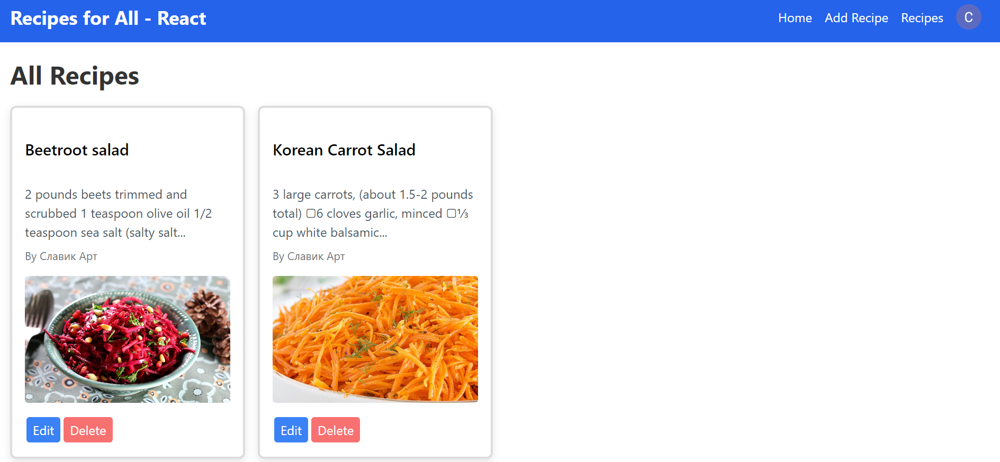
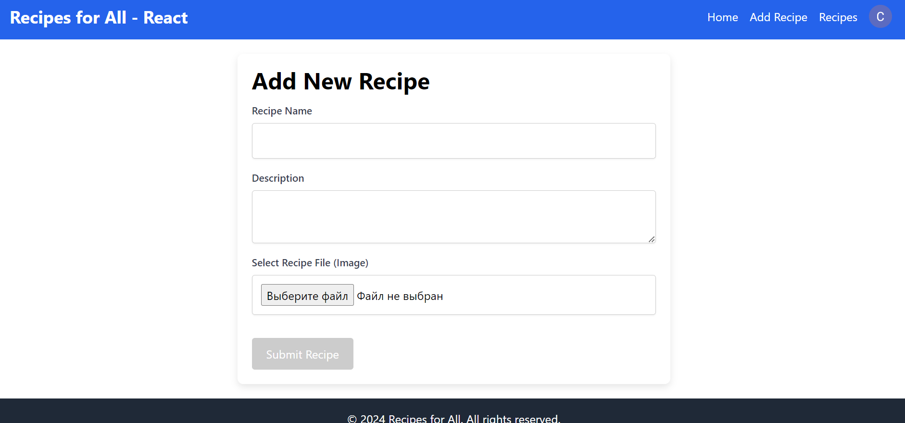
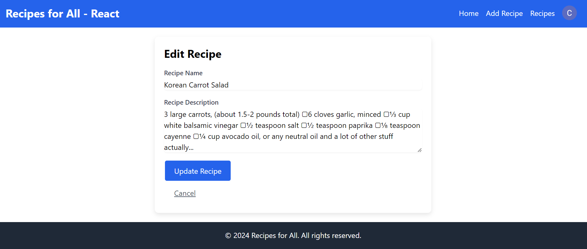
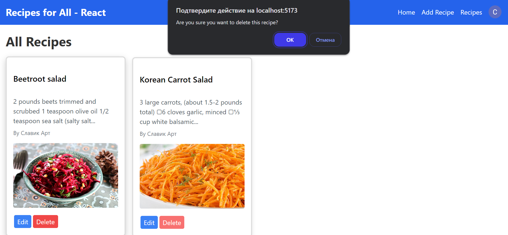
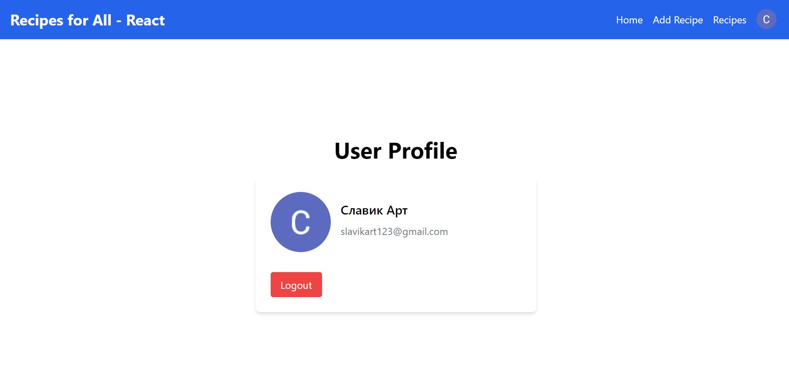
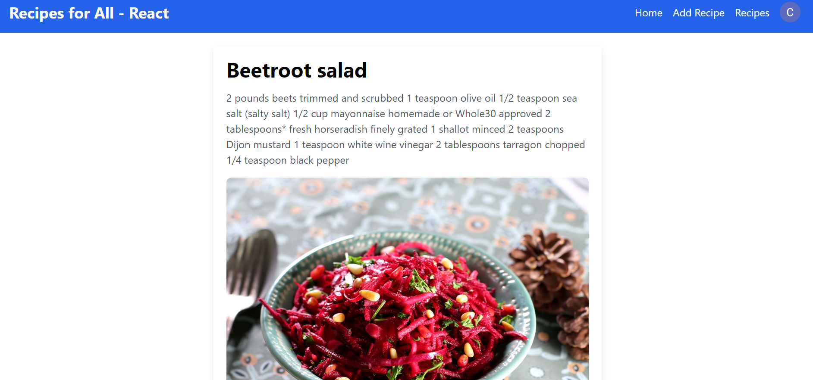

# RecipesForAll - React

### React version 18.3.1, Tailwind, Firebase (DB, Storage, Google Auth).

## Home Page

## Recipes Page

## Add New Recipe

## Edit Recipe Page

## Delete Recipe Page

## User Profile Page

## Detail View Page

